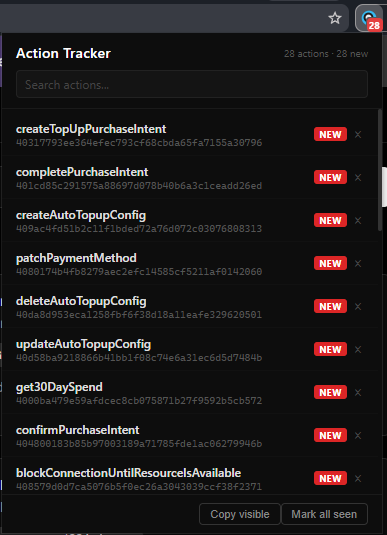

# Action Tracker

Browser extension for bug bounty hunters that discovers and tracks **Next.js server actions** exposed in client bundles.

Next.js apps register server actions via `createServerReference(hash, ...)` in their JavaScript bundles. This extension finds them automatically, persists them per domain, and alerts you when new ones appear.

## Features

- Detects Next.js apps automatically
- Scans all loaded scripts (initial + lazy-loaded chunks) for `createServerReference` calls
- Extracts action name and hash
- Persistent storage per domain
- Badge notification on new actions
- Search/filter by name
- Copy individual hash or bulk copy visible actions
- Mark actions as seen (individually or all at once)
- Re-scans on SPA navigation

## Screenshots

## Install

**Chrome**

1. Clone this repo
2. Go to `chrome://extensions`
3. Enable Developer mode
4. Click "Load unpacked" and select the project folder

**Firefox**

1. Go to `about:debugging` > This Firefox
2. Click "Load Temporary Add-on"
3. Select `manifest.json`

## How it works

1. Content script checks for Next.js indicators (`#__next`, `#__NEXT_DATA__`, `/_next/` scripts)
2. Scans all `<script>` tags — fetches external sources and parses inline content
3. Regex extracts `createServerReference` calls with their hash and action name
4. MutationObserver catches dynamically loaded chunks
5. URL polling detects SPA navigations and triggers re-scan
6. Background service worker persists actions and manages badge count

## License

MIT
